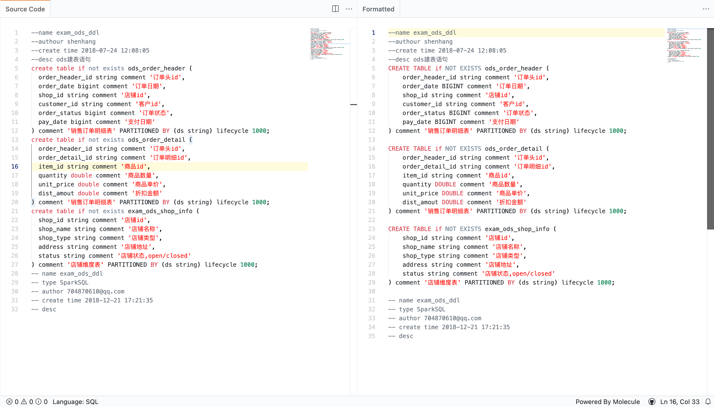

# Online Code Formatting

一个优雅的在线代码格式化工具，支持常见的 **`JSON、SQL、XML、Markdown`** 等语言。

## 切换语言

- 使用快捷键 `Command/Ctrl + L` 打开切换面板，选择需要格式化的语言。
- 点击左下角状态栏中 **Language** 栏，在列表中选择

## 感谢

- [sql-formatter](https://github.com/zeroturnaround/sql-formatter)
- [xml-formatter](https://github.com/chrisbottin/xml-formatter)

## TODO

- Javascript (TODO)
